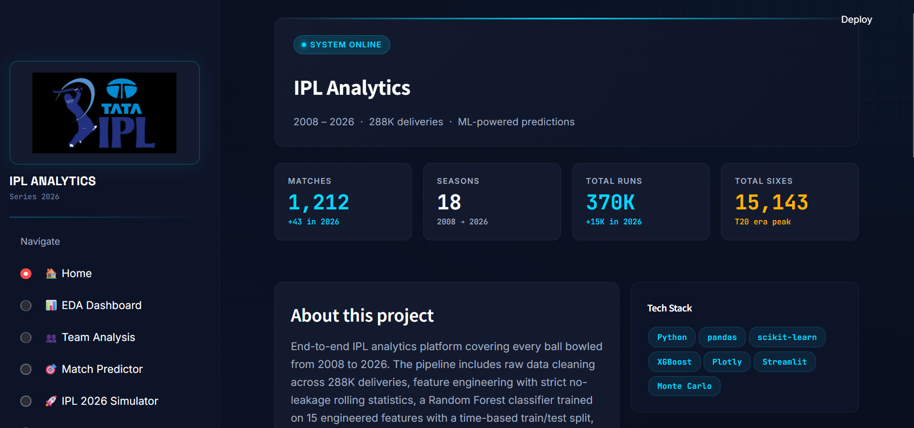
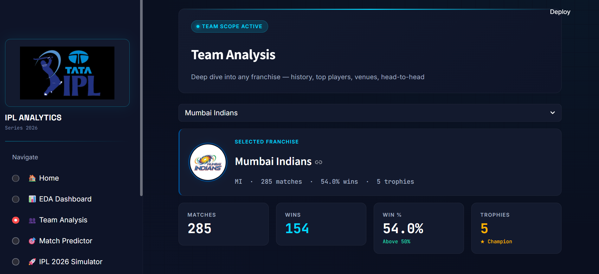
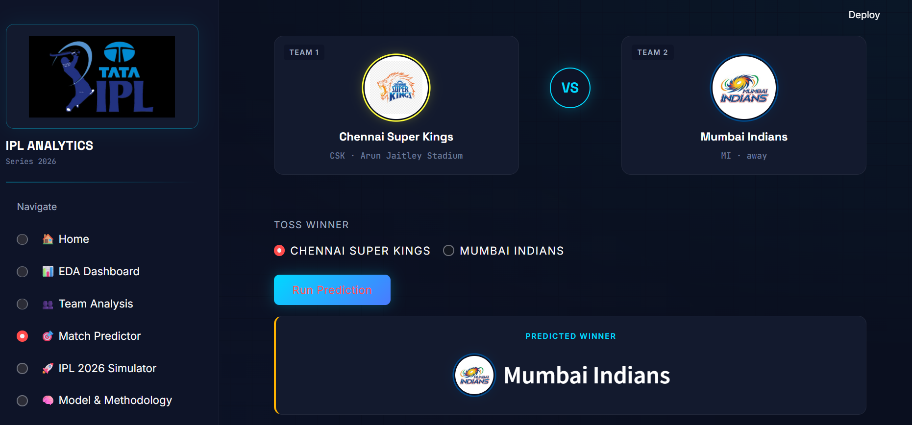
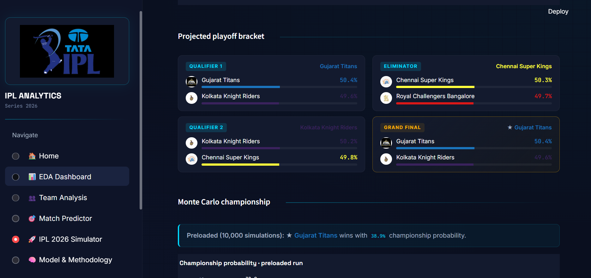
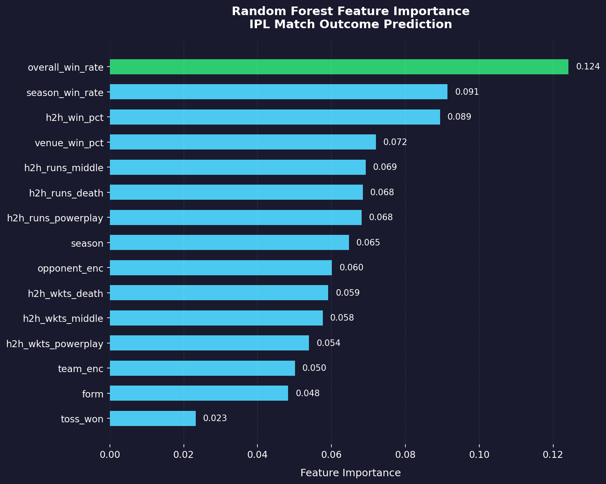
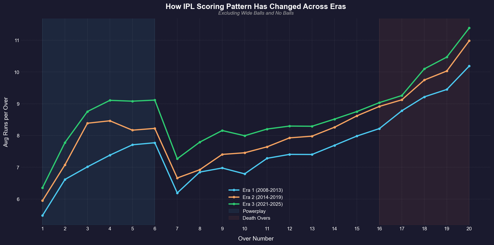
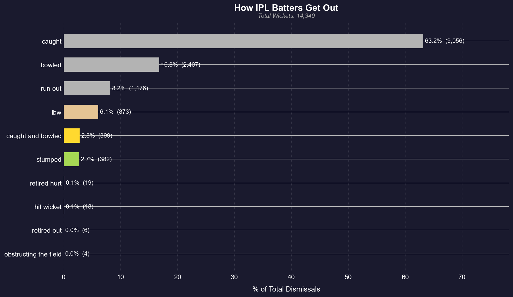

<div align="center">

# 🏏 IPL Analytics Engine

### End-to-end ML platform for IPL match prediction and playoff simulation


**[🚀 Live Demo](https://harsh-ipl-analytics.streamlit.app/)** &nbsp;·&nbsp; **[📝 Blog Post]({{BLOG_URL}})** &nbsp;·&nbsp; [💼 LinkedIn](https://www.linkedin.com/in/harsh-palyekar-790209295)

</div>

---

<div align="center">
  
</div>

> Six-page Streamlit dashboard covering every ball bowled in IPL history (2008–2026). Ball-by-ball analytics across **288,226 deliveries** and **1,212 matches**, ML-powered match prediction using a Random Forest classifier on 15 engineered features, and a 10,000-iteration Monte Carlo playoff simulator.

---

## ✨ Highlights

- **15-feature ML pipeline** with strict no-leakage rolling statistics (`.shift(1).expanding()`)
- **Time-based train/test split** — train on 2008–2023, test on 2024–2025 (no future leakage)
- **Three models compared**: Logistic Regression (43% acc), **Random Forest (51% acc)**, XGBoost (50% acc)
- **Manual data verification** of 14 historical IPL finals (raw data had incorrect winners)
- **Monte Carlo playoff simulator** with blended team strength scores (60% recent form, 40% historical)
- **6 pages**, ~1,900 LOC, real team logos, custom plotly theme

## 🎯 Why ~51% Accuracy Is Actually Good

T20 cricket has high **irreducible variance** — a single dropped catch, a rain interruption, or a fluke dismissal can flip the outcome. Bookmakers' implied probabilities for IPL matches typically sit between 45–55% for both sides; few games are pre-decided. The point of this model isn't predicting individual matches confidently — it's identifying *relative* team strength, which directly drives the playoff simulation.

## 📦 What's Inside

| Page | What it does |
|---|---|
| 🏠 **Home** | Project overview, headline KPIs, all 10 active teams |
| 📊 **EDA Dashboard** | 8 visualizations: team win %, toss impact, top players, era comparison, dot-ball trends |
| 👥 **Team Analysis** | Per-team deep dive — trophies, win % by season, top batters/bowlers, venue performance, H2H |
| 🎯 **Match Predictor** | Live ML inference — pick teams + venue, get win probability with feature breakdown |
| 🚀 **2026 Simulator** | Points table, strength scores, playoff bracket, Monte Carlo championship |
| 🧠 **Model & Methodology** | Pipeline architecture, feature definitions, model comparison, feature importance |

---

## 📸 App Screenshots

### Team Analysis — per-franchise deep dive with trophies, win rate, and venue breakdown

<div align="center">
  
</div>

### Match Predictor — live ML inference with team logos and prediction breakdown

<div align="center">
  
</div>

### IPL 2026 Simulator — projected playoff bracket and Monte Carlo championship odds

<div align="center">
  
</div>

---

## 📈 Sample Insights from the Data

Three findings worth a closer look — full set of EDA plots in [`plots/`](plots/).

### Which features actually drive match predictions

<div align="center">
  
</div>

`overall_win_rate` dominates — historical team quality is the strongest signal. Toss-winning, despite the popular myth, barely moves the needle.

### How T20 scoring patterns have evolved across three eras

<div align="center">
  
</div>

Death-over scoring has accelerated dramatically — modern teams score noticeably faster in overs 16–20 than the 2008–2013 era.

### How IPL batters get out

<div align="center">
  
</div>

Catches dominate by a wide margin — but the long tail of bowled, LBW, run out, and stumping shows the diversity of bowling threats batters face.

---

## 🛠️ Technical Architecture

```
Raw CSVs (5 files, team_ids mapped)
       ↓
Cleaning (Rising Pune duplicate fix, season normalization, bool coercion)
       ↓
Feature engineering (15 features, .shift(1).expanding() to prevent leakage)
       ↓
Time-based train/test split (train: 2008-2023, test: 2024-2025)
       ↓
Model training (LR baseline, RF, XGBoost)
       ↓
Serialized to rf_model.pkl
       ↓
Streamlit app loads model for live inference
```

### The 15 Features

| Category | Features |
|---|---|
| **Identity** | `team_enc`, `opponent_enc`, `season` |
| **Toss** | `toss_won` |
| **Form** | `form` (5-match rolling), `overall_win_rate`, `season_win_rate` |
| **Matchup** | `h2h_win_pct`, `venue_win_pct` |
| **Phase splits** | `h2h_runs_{powerplay,middle,death}`, `h2h_wkts_{powerplay,middle,death}` |

All rolling stats use `.shift(1)` before the window to prevent the current match from leaking into its own features.

## 🚦 Running Locally

```bash
# Clone
git clone https://github.com/harsh241005/ipl-analytics.git
cd ipl-analytics

# Install (Python 3.10+ recommended)
pip install -r requirements.txt

# Run
streamlit run app.py
```

The app will open at `http://localhost:8501`.

### Data files

The repo includes everything needed to run:
- `matches_clean.csv` — 1,212 IPL matches (2008–2026)
- `deliveries_clean.csv` — 288,226 ball-by-ball records
- `points_table_2026.csv`, `strength_table_2026.csv`, `championship_prob_2026.csv` — 2026 season state
- `rf_model.pkl`, `scaler.pkl` — trained model artifacts
- `assets/logos/` — 16 team logos

## 🧪 Model Performance

| Model | Accuracy | ROC-AUC |
|---|---:|---:|
| Logistic Regression | 0.428 | 0.452 |
| **Random Forest** | **0.510** | **0.504** |
| XGBoost | 0.497 | 0.491 |

*Evaluated on the 2024–2025 hold-out set using time-based split.*

### Feature importance (Random Forest)

```
overall_win_rate  ████████████████████  0.202
h2h_win_pct       ████████████████      0.146
season_win_rate   ███████████████       0.140
season            ████████████          0.117
venue_win_pct     ████████████          0.115
opponent_enc      ██████████            0.102
team_enc          ████████              0.079
form              ███████               0.068
toss_won          ███                   0.032
```

`overall_win_rate` dominates — historical team quality is the strongest single signal. `toss_won` is the weakest, matching the well-known finding that winning the toss alone barely moves the needle.

## 🧹 Data Quality Notes

The raw dataset had **incorrect winners for 14 historical IPL finals** — the `match_winner` field stored the team that won the last match of the season, but the last *played* match isn't always the final due to schedule quirks. These were manually verified against trusted sources and corrected in `model3.ipynb` before computing trophy counts and training the model.

## 📓 Notebooks

The data science work behind the app, in execution order:

| Notebook | What it does |
|---|---|
| [`datacleaning.ipynb`](notebooks/datacleaning.ipynb) | Map team_ids, fix Rising Pune duplicate, normalize seasons |
| [`feature_engineering.ipynb`](notebooks/feature_engineering.ipynb) | Build the 15 features with `.shift(1)` no-leakage logic |
| [`eda_visualisations.ipynb`](notebooks/eda_visualisations.ipynb) | Exploratory analysis — basis for the EDA Dashboard page |
| [`model2.ipynb`](notebooks/model2.ipynb) | Train LR, RF, XGBoost with time-based split |
| [`model3.ipynb`](notebooks/model3.ipynb) | Phase-split features and manual correction of 14 historical finals |

Open any notebook on GitHub for a rendered view of code, outputs, and markdown.

## 🔮 Roadmap

- [ ] Player-level analysis page (career arcs, matchup heatmaps)
- [ ] Ball-by-ball win probability model (à la CricInfo's WinViz)
- [ ] Calibration analysis vs bookmaker implied probabilities
- [ ] CI: ruff + pytest on push

## 📂 Repo Structure

```
ipl-analytics/
├── app.py                          # Main Streamlit application (~1,900 LOC)
├── requirements.txt                # Pinned dependencies
├── .streamlit/
│   └── config.toml                 # Theme settings
├── matches_clean.csv               # 1,212 matches
├── deliveries_clean.csv            # 288K deliveries
├── points_table_2026.csv
├── strength_table_2026.csv
├── championship_prob_2026.csv
├── rf_model.pkl                    # Trained Random Forest
├── scaler.pkl                      # StandardScaler (for LR baseline)
├── features.pkl                    # Feature name list
├── assets/
│   ├── logos/                      # 16 team logos
│   └── screenshots/                # App page screenshots
├── notebooks/                      # Training and EDA notebooks
│   ├── datacleaning.ipynb
│   ├── feature_engineering.ipynb
│   ├── eda_visualisations.ipynb
│   ├── model2.ipynb
│   └── model3.ipynb
├── plots/                          # Exported EDA chart images
└── README.md
```

## 🛠️ Tech Stack

- **Language**: Python 3.10+
- **Data**: pandas, numpy
- **ML**: scikit-learn (RandomForestClassifier, LogisticRegression), XGBoost
- **Viz**: Plotly (interactive charts)
- **App**: Streamlit (custom CSS theme, ~600 LOC of styling)
- **Deployment**: Streamlit Community Cloud

## 📝 Read More

For a deeper dive into the technical decisions — especially the no-leakage feature engineering and the model evaluation philosophy — read the **[accompanying blog post]({{BLOG_URL}})**.

## 👤 About

Built by **Harsh** — B.Sc. Data Science graduate, Goa University (2026). Available for full-time data analyst / data scientist roles in India.

[LinkedIn]({{LINKEDIN_URL}}) · [GitHub](https://github.com/harsh241005) · [Other Projects](https://github.com/harsh241005?tab=repositories)

## 📄 License

MIT — see [LICENSE](LICENSE) for details.

---

<div align="center">
<sub>If you found this useful or interesting, a ⭐ on the repo would mean a lot.</sub>
</div>
